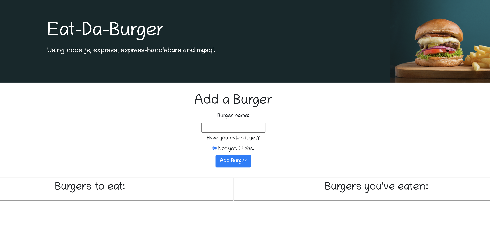
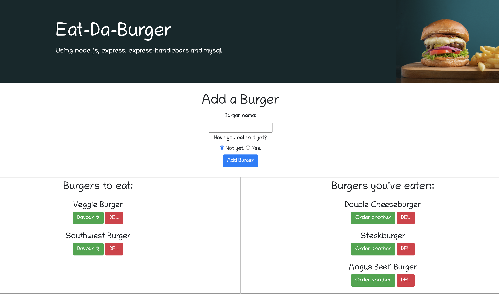

# Eat-Da-Burger

Visit the deployed site: https://spacialfray-eatdaburger.herokuapp.com/

## Description

Eat-Da-Burger uses node.js, express, handlebars, and a custom orm to interface with a burgers database. Using Eat-Da-Burger, you can insert, update, and delete burgers from the database using a friendly GUI.

No installation is necessary to enjoy this app. Just visit the [webpage](https://spacialfray-eatdaburger.herokuapp.com/).

---

## Screenshots

### Eat-Da-Burger before adding any burgers

### Eat-Da-Burger with some example burgers added

---

## License

